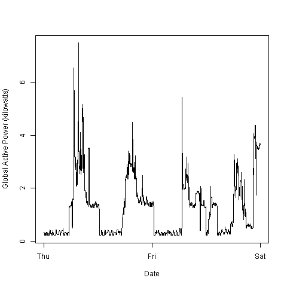
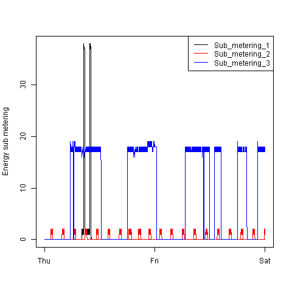

```{r}
```

---
 Git fork: <https://github.com/dar7yl/ExploratoryDataAnalysis>

 Data source: <https://archive.ics.uci.edu/ml/datasets/Individual+household+electric+power+consumption#>
 
```{r check_data}
file.info("exdata_data_household_power_consumption.zip")$ctime
```

## Loading the data
(hint from <http://stackoverflow.com/questions/13022299/specify-date-format-for-colclasses-argument-in-read-table-read-csv/13022441#13022441>)
```{r load_data}

source("src/load_data.R")
hpc <-load_data()

```
# Project 1 Plots

## Plot 1
```{r Plot1}
source("src/plot1.R")
```
 

## Plot 2
```{r Plot2}
source("src/plot2.R")
```
 

## Plot 3
```{r Plot3}
source("src/plot3.R")
```
 

------------------
Exploratory plots:
```{r, plot_graphs, echo=FALSE}
plot(hpc$Global_active_power, type="l")
plot(hpc$Voltage, type="l")
plot(hpc$Global_intensity, type="l")

hist( hpc$Global_active_power,
	  main="Global Active Power",
	  xlab="Global Active Power (kilowatts)", ylab="Frequency", 
	  col="red")

rug(hpc$Global_active_power)

with( hpc, {plot(DateTime,Sub_metering_1, col="black", 
					  type="l", ylab="Energy sub metering"); 
				lines(DateTime,Sub_metering_2, col="red"); 
				lines(DateTime,Sub_metering_3, col="blue");
				})
legend("topright", legend=c("Sub_metering_1", "Sub_metering_2", "Sub_metering_3"),
		col=c("black", "red", "blue"), lty=c(1,1,1) )
```

